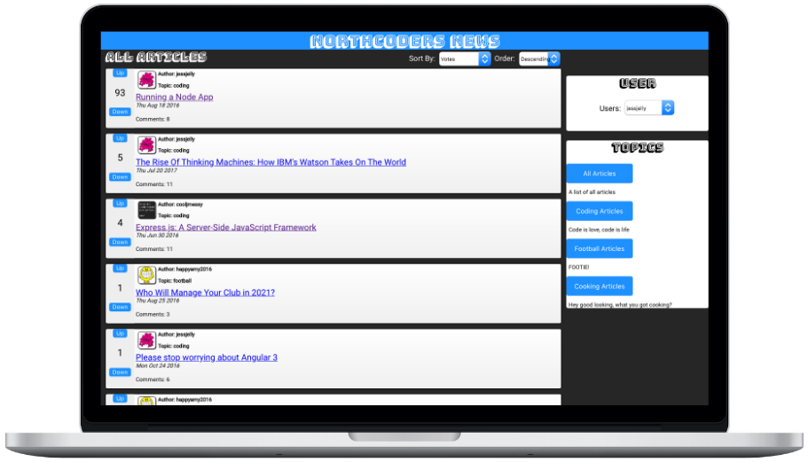

# Northcoders News Backend API

This repository contains the Node.js backend API of the Full Stack Northcoders News project.

|               | Link                                                                           |
| ------------- | ------------------------------------------------------------------------------ |
| Backend API   | [https://bt-nc-news.herokuapp.com/api](https://bt-nc-news.herokuapp.com/api)   |
| Frontend Repo | [https://github.com/tben140/fe-nc-news](https://github.com/tben140/fe-nc-news) |
| Frontend Site | [https://bt-fe-nc-news.netlify.app](https://bt-fe-nc-news.netlify.app)         |



## Getting Started

These instructions will get you a copy of the project up and running on your local machine for development and testing purposes.

Ensure Node.js and npm are installed before proceeding.

First, change to the destination directory then run the following command in your terminal:

```bash
git clone https://github.com/tben140/be-nc-news.git
```

Next, cd into the project directory and install the project dependencies with the following commands:

```bash
cd be-nc-news
npm install
```

If PostgreSQL is not installed on your system, install PostgresApp from [https://postgresapp.com](https://postgresapp.com).

Next, run the following terminal command in the project directory the create the test and production databases:

```bash
npm run setup-dbs
```

Once the test and production databases are created, run the following commands to seed the test and production databases respectively:

```bash
npm run seed-test
npm run seed
```

To start the server locally, run the following command, then go to [https://localhost:9090](https://localhost:9090):

```bash
npm start
```

## Running the tests

The following commands can run the tests for the main app and DB utilities respectively:

```bash
npm test
```

```bash
npm run test-utils
```
